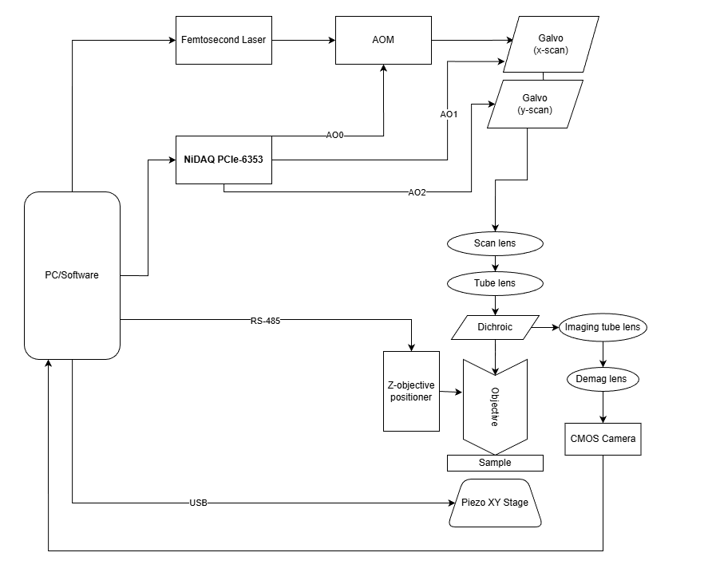
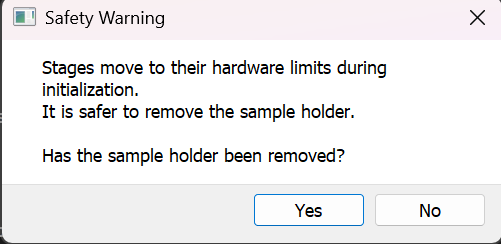
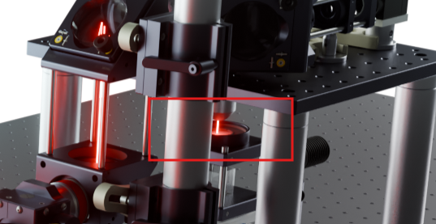
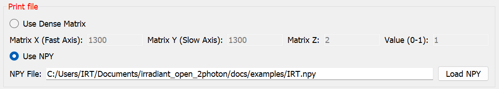
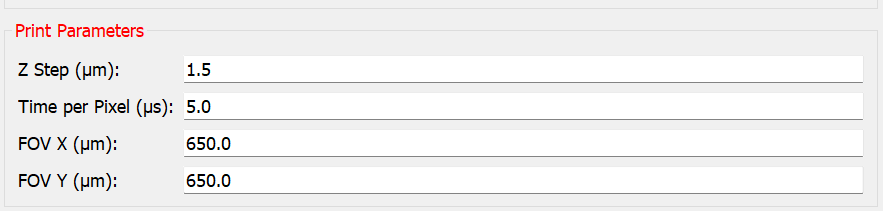
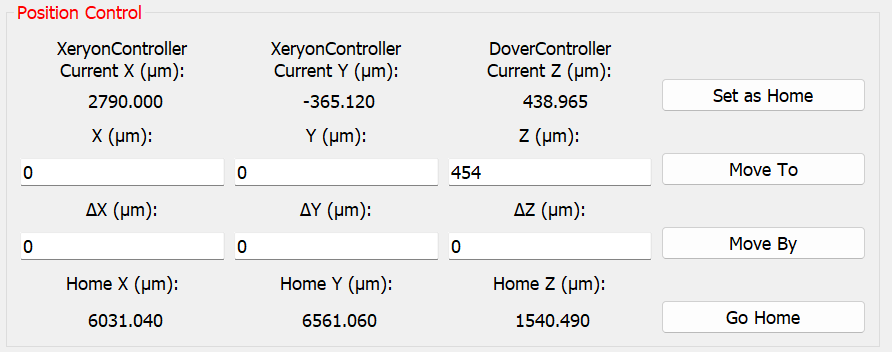
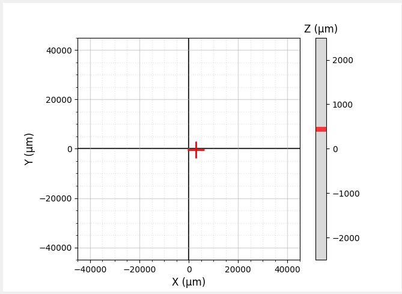

# Irradiant's Open Source Two Photon Lithography System

**Irradiant-2photon** is a galvo–galvo point-scan two-photon lithography tool.

This repository contains the lithography software stack that enables arbitrary voxel-level grayscale control through simple three-dimensional NumPy matrices.

## Software Features

This software stack enables 3D printing through synchronized multi-channel control of galvo positions, laser power, and stage motion. It includes:
- PyQt5 GUI for interactive control
- Support for multiple stage controllers:
  - Xeryon
  - Thorlabs PDXC2
  - Dover DOF-5
  - Mock controllers (no hardware required)
- Signal generation using National Instruments DAQ
- Joystick support for manual positioning

## Installation
See the [setup.md](docs/setup.md) for full, step-by-step setup instructions covering:
- Python installation and environment setup
- Driver installation
- Hardware detection
- config.py customization
- Stage limits and calibration

No source code modifications are required for standard operation.

## System Overview


The Irradiant-2photon software synchronizes:
- X/Y galvo scanning
- AOM power modulation
- Z-axis motion

A volume is printed by sequentially generating individual **XY frames**, rastering from **left to right along X** and then **top to bottom along Y**. Printing begins at the **bottom-most Z plane** and proceeds upward, layer by layer.

For more details on the software workflow and control signals sent to the hardware, see [software_overview.md](docs/software_overview.md)

## Input File Format
Irradiant-2photon uses a voxel-based lithography model in which print files are defined as three-dimensional NumPy arrays. Each voxel directly encodes the relative exposure dose applied at a specific spatial location within the print volume which enables arbitrary volumetric grayscale control.

### Array Semantics
Each element in the array corresponds to a single voxel in the printed volume:
```
matrix[y, x, z]
```
- X: Fast scan axis (galvo X)
- Y: Slow scan axis (galvo Y)
- Z: Layer index

### Exposure Dose Encoding
Array values encode the relative exposure dose at each voxel.
- Array values are interpreted as **normalized laser power fraction** in the range `[0, 1]`:
  - `0.0` corresponds to no exposure
  - `1.0` corresponds to 100% of the laser power
  - Values between `0.0` and `1.0` correspond to **linearly interpolated power fractions**

During printing, these normalized values are scaled by the configured AOM voltage amplitude in `config.py`, such that a value of 1.0 in the array corresponds to 100% of the maximum laser power defined in the system configuration. See [setup.md](docs/setup.md) for more details.

#### See [docs/examples](docs/examples/examples.md) for input example files.

## Running the Software

From the project root, run the application:
```bash
python main.py
```

On startup, the software:
- Detects available hardware
- Initializes and homes all stages (or multiple axes, if applicable)
- Loads the previous session state
- Opens the main control GUI

## GUI Usage

The GUI is divided into the following sections:
- Print File
- Print Parameters
- Run / Stop Print
- Position Control
- Stage Minimap
- Laser Control

Each section is described below.

#### GUI Startup
On startup, a safety warning prompt will ask whether the sample holder has been removed. This prompt is included due to the physical dimensions of our setup, as shown below. Because of the height of the sample holder, there is a risk of collision with the objective when the stages move to their hardware limits during initialization. The prompt serves as a reminder to prevent this risk. If there is no possibility of collision between the sample holder and the objective in your setup, the prompt may be safely ignored.





#### 1. Print File

#### 1.1 Use Dense Matrix
A dense, uniform matrix using a single input value will be printed.
- Matrix X: number of pixels in the fast scan axis
- Matrix Y: number of pixels in the slow scan axis
- Matrix Z: number of layers
- Value (0-1): normalized laser power fraction
    - Values greater than `1.0` are clamped to `1.0`, and an empty matrix (all zeros) results in no print.
    - A value of `1.0` corresponds to **100% of the maximum laser power** as defined by the configured AOM voltage amplitude. See [setup.md](docs/setup.md) for more details.

#### 1.2 Use NPY
- Load a **3D NumPy (`.npy`) file** representing a voxelized print volume.
- The array shape must be: `(matrix_y, matrix_x, matrix_z)`, corresponding to **Y (slow axis), X (fast axis), and Z (layers)**
- When an NPY file is loaded, **Matrix X / Matrix Y / Matrix Z fields are ignored**, as the print dimensions are taken directly from the array shape.
- Example input files can be found in the [docs/examples](docs/examples/examples.md) directory.



### 2. Print Parameters

The following parameters are applied to the above print file:
- **Z Step (µm):** Distance the Z stage moves between layers, applied after each completed XY scan. **This is how the voxel spacing in Z is defined.**
- **Time per Pixel (µs):** Dwell time per pixel (output sample rate).
- **FOV X / FOV Y (µm):** Physical scan size in X and Y. **This is how the voxel spacing in X and Y is defined.**
  - Must remain within galvo limits defined in config.py
  - See [setup.md](docs/setup.md) for more details on FOV calibration 



### 3. Printing: Start Print

#### 3.1 Start Print
- Locks stage motion
- Turns off the laser if it was previously on
- Loads the selected matrix (ones or NPY)
- Starts the printing thread

#### 3.2 Stop Print
- This button can be pressed at anytime to safely stop the running print
- Returns the Z axis to its original starting position
- Releases the movement lock
- After completion or error:
  - Printing state is reset
  - GUI controls are re-enabled

### 4. Position Control
- **Current Position**: Displays current position X, Y, and Z (in µm), including active controller type
- **Set as Home**: Saves the current X/Y/Z position as the new home position for **Go Home** button and after prints complete
- **Move To**: Absolute motion in µm, moves each axis to the specified coordinate
- **Move By**: Relative motion in µm, applies an offset to the current position, resets to zero after execution
- **Go Home**: Moves all axes back to the stored home position



### 5. Stage Minimap
The minimap provides a real-time visualization of stage position:
- X/Y position shown as a red cross
- Z position shown using a vertical color bar
- Limits are derived from `STAGE_POSITION_LIMITS` in config.py
- Grid spacing and scaling reflect real physical units



### 6. Laser Control

Laser: OFF / Laser: ON
- Toggles the AOM output voltage
- Disabled automatically while a print is running
- Uses the detected voltage backend

### 7. Joystick Support (Optional)
If a joystick is connected, it is enabled automatically.
- Movements:

| Control | Action |
|---------|--------|
| Left Stick: Axis 0 | X motion |
| Left Stick: Axis 1 | Y motion |
| Right Stick: Axis 3 | Z motion |
| Button 0 | Toggle laser |
| Button 1 | Start / stop print |
| Button 5 (hold) | Fine control mode |

Joystick input is ignored while a print is running.

## Test Scripts

### `tests/aom_set_power_test.py`

This test script allows manually sending a fixed analog voltage to a specified DAQ output channel. It's currently configured to control the AOM by setting a voltage between 0 and 1 V. This script can be used when testing and aligning the laser through the AOM. 

To run:
```bash
python -m tests.aom_set_power_test
```

## Contributing

We welcome contributions to Irradiant-2photon, including software, hardware, and system design improvements.

Please see [CONTRIBUTING.md](CONTRIBUTING.md) for detailed guidelines.


## Citation

If you use this software in your research, please cite:

Shabahang, S., et al. "[A low-cost, open-access two-photon lithography tool](https://www.researchgate.net/publication/399865523_A_low-cost_open-access_two-photon_lithography_tool)." SPIE Photonics West, January 2026.

**Note:** This link will be updated once the conference proceedings are published.