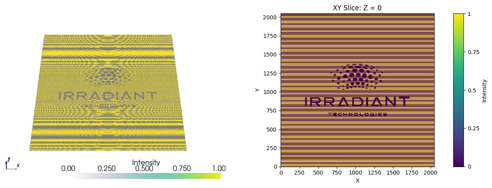
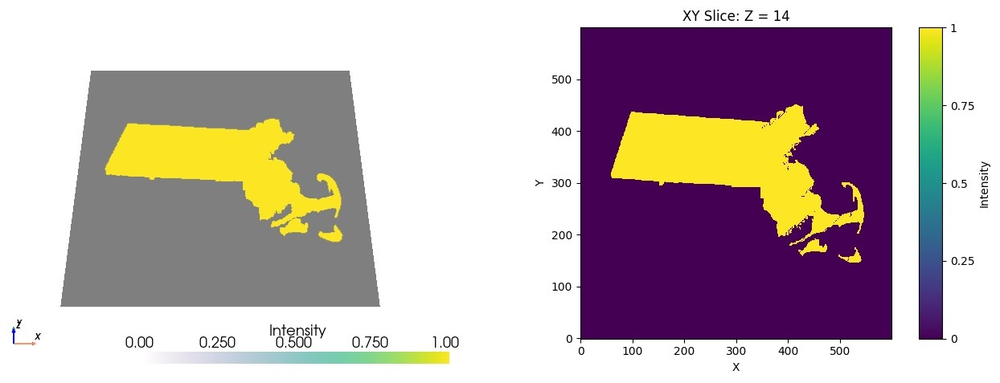
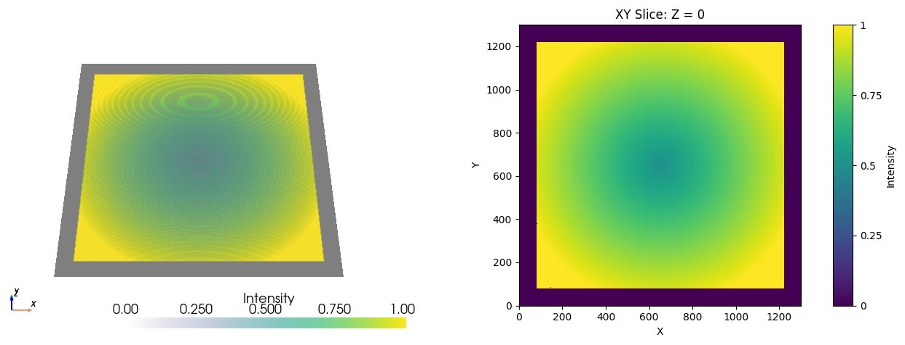

# Examples Files

## 1. 2D Irradiant Technologies logo with a diffraction grating (binary - 0s and 1s)

- Path: [IRT.npy](IRT.npy)
- Size: (X, Y, Z) = (2048, 2048, 1)
- Recommended Print FOV: X = 500 µm, Y = 500 µm

3D view (left) with gray slice plane and XY slice (right):

## 2. 3D Massachusetts state map (binary - 0s and 1s)

- Path: [MA_state_map.npy](MA_state_map.npy)
- Size: (X, Y, Z) = (600, 600, 29)
- Recommended Print FOV: X = 400 µm, Y = 400 µm
- Recommended Z step: 1.5 µm

3D view (left) with gray slice plane and XY slice (right):

## 3. 2D Circular gradient matrix (grayscale)

- Path: [gradient_circular.npy](gradient_circular.npy)
- Size: (X, Y, Z) = (1300, 1300, 1)
- Recommended Print FOV: X = 400 µm, Y = 400 µm

3D view (left) with gray slice plane and XY slice (right):

