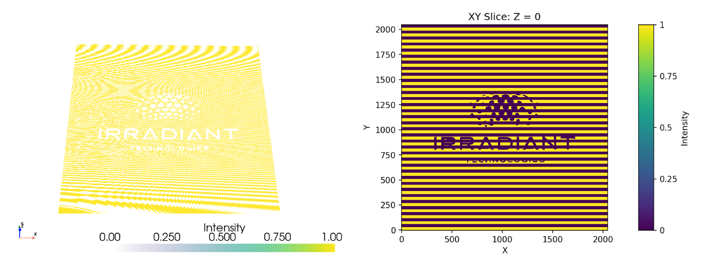

# Examples Files

## 1. 2D Irradiant Technologies Logo with a Diffraction Grating

3D view (left) and XY slice (right):

- Path: [IRT.npy](IRT.npy)
- Size: (X, Y, Z) = (2048, 2048, 1)
- Recommended Print FOV: X = 500 µm, Y = 500 µm