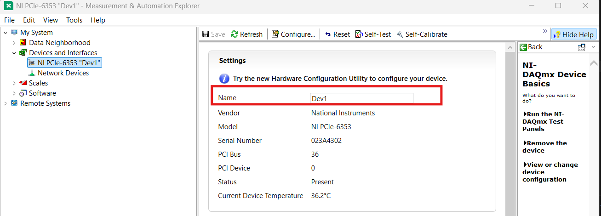
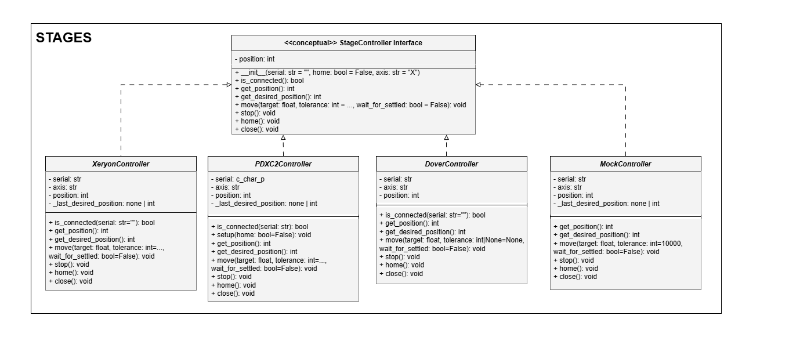

# Installation and Configurations Instructions

## Introduction

This document provides **step-by-step installation and configuration instructions** for setting up Irradiant-2photon on **Windows** for the first time.

It covers the installation and configuration of all the required software to integrate hardware supported by the system.
- There's safe handling of missing hardware (install only what you intend to use):
    - No stages &rarr; Mock controllers used (no physical motion)
    - No DAQ &rarr; No analog signals generated
    - No joystick &rarr; Movement commands only controlled via the GUI

Configuration changes are limited to `config.py` as specified throughout this markdown. No source code modifications are required for normal operation.


## Supported Platform

- **Windows 10 / Windows 11**
- Python **3.9+ (64-bit)**
- Administrator access required for driver installation


## 1. Python Environment 

### 1.1 Install Python 3.9+ (64-bit)
Download and install Python from:
https://www.python.org/downloads/windows/ 

### 1.2 Create a Virtual Environment
```bash
  python -m venv venv
  venv\Scripts\activate
```

### 1.3 Install Python Dependencies
```bash
  pip install -r requirements.txt
```


## 2. Hardware Device Configuration Summary

Irradiant-2photon supports multiple stage configurations and is designed to be flexible, allowing different combinations depending on available hardware.

Supported Stage Types:
- **Thorlabs PDXC2 piezo controllers**
    - Typically configured for **X**, **Y**, and **Z**
- **Xeryon linear stages**
    - XLS-3-120-5 for **X**/**Y**
    - XVP-80-5 for **Z**
- **Dover Motion DOF-5 Objective Focusing Stage**
    - Used for **Z** motion only
- **Mock stage controllers**
    - Software-only fallback; No physical motion

The detection priority is: Xeryon > Thorlabs PDXC2 > Dover Stages > Mock Controllers.

**Configuration Note**

Serial numbers, COM port detection, and motion limits must match the physical setup. All of these are configured in `config.py`.

## 3. Stage Controller Installation

### 3.1 Thorlabs PDXC2 Piezo Controllers (X, Y, Z)
Install Thorlabs Kinesis Motion Control Software:
https://www.thorlabs.com/software-pages/Motion_Control

The default installation path should be:
```
C:\Program Files\Thorlabs\Kinesis
```
If installed elsewhere, update `PDXC2_CONFIG["kinesis_path"]` in `config.py`.

**Verification**:
- Open Thorlabs Kinesis
- Confirm all three PDXC2 controllers appear
- Note each controller’s serial number. These must be updated in `config.py` under `PDXC2_CONFIG["device_serials"]`.

### 3.2 Xeryon Linear Stages (XLS/XVP)
No additional driver installation is required (USB serial communication).

**Verification**:
- Open Windows Device Manager
- Navigate to Ports (COM & LPT)
- Locate the Xeryon device. This should be listed as a USB Serial Device.
- Open Properties &rarr; Details &rarr; Select the Property "Hardware Ids":
    - You should see an entry such as: `USB\VID_04D8&PID_XXXX...`
    - The value after `VID_` must match `XERYON_CONFIG["hardware_id"]` in `config.py`.
    - For example: `"hardware_id": "04D8"`


### 3.3 Dover Motion DOF-5 - Objective Focusing Stage
Install the Motion Synergy API:
https://dovermotion.com/resources/manuals/

Choose an appropriate installation directory and update `_DOVER_ROOT` in `config.py` accordingly.
Example:
```
C:\Users\Irradiant\Dover\MotionSynergy
```

In addition to the Motion Synergy API, the following must also be installed (provided by Dover Motion after a stage purchase):
- MOXA USB driver: `\driv_win_uport1p_v3.1_build_20021317_whql.exe`
- Pro-motion sofware: `\36172-01-Pro-MotionInstall520Dover.exe`

Follow the DOF-5 RS-485 Quick Start Guide (available on [Dover’s website](https://dovermotion.com/resources/manuals/
)) to:
- Configure USB/serial settings (Device Manager)
- Perform initial tuning (Pro-Motion)
- Generate the required `SupportFolder\Instrument.cfg` file (MotionSynergyGUI)

**Verification**
- Launch: `{_DOVER_ROOT}\MotionSynergyGUI.exe`
- Click **Initialize & Home All**. See the output in the application, this should confirm that you've set-up the device correctly.
- Run: `{_DOVER_ROOT}\SourceCode\Examples\Python\ConsoleApplication\ConsoleApplication.py`. 
    - This will confirm that your python environment is configured correctly. 
    - If you encounter issues loading DLLs, ensure that a Microsoft Visual C++ Redistributable is installed under System Settings &rarr; Apps &rarr; Installed Apps. If missing, download it here: [Microsoft Visual C++ Redistributable latest supported downloads](https://learn.microsoft.com/en-us/cpp/windows/latest-supported-vc-redist?view=msvc-170#latest-supported-redistributable-version)

**Tips**
- When initially configuring the device, ensure that the baud rate in **Device Manager &rarr; Ports (COM & LPT) &rarr; MOXA USB Serial Port &rarr; Properties &rarr; Port Settings** matches the baud rate configured in through Pro-Motion. 
- Also, ensure that the COM port assigned to the MOXA USB device (for example, COM1) matches the COM port used when initializing Pro-Motion.


- Configuring the device through MotionSynergyGUI directly updates `SupportFolder\Instrument.cfg`. When initially configuring, ensure that the correct COM port is entered correctly and the **address is set to 0**.


**Recommended Modifications to Dover Initialization Files**

Verify the following settings in `SupportFolder\Instrument.cfg`:
- Line 35: `hwid=COM1`
    - This should match the COM port in the MOXA USB serial device.
- Line 117: `nodeID=0` 

**Optional:** Muting stage logging output in the GUI terminal output.

Modify the following in `SupportFolder\Logger.cfg`:
- Lines 14-20: Comment out the console output section by adding `;` to the start of each line.

## 4. Signal Generation Hardware: NI DAQ
This section assumes the DAQ PCIe card is physically installed and properly seated.

Install NI-DAQmx:
https://www.ni.com/en/support/downloads/drivers/download.ni-daqmx.html

All the default installation settings will be sufficient.

**Verification**:
- Open NI Measurement & Automation Explorer (NI MAX)
- Navigate to Devices and Interfaces &rarr; NI-DAQmx Devices. Locate your device, e.g., `Dev1 (USB-6343)`
- The device name must match `DAQ_DEVICE = "Dev1"` in `config.py`


Source: Screenshot captured from [National Instrumentation's](https://www.ni.com/en.html) NI Measurement & Automation Explorer (NI MAX).

## 5. Joystick (Optional)
Irradiant-2photon supports USB game controllers via `pygame`.
- Only the first detected joystick is used.
- No additional software installation is required, as Windows 10/11 includes built-in drivers for this device.

**Supported Joysticks**: Any USB joystick or gamepad supported by pygame
- This includes: Xbox controllers, logitech gamepads, and generic USB HID controllers
- Movements:

| Control | Action |
|---------|--------|
| Left Stick: Axis 0 | X motion |
| Left Stick: Axis 1 | Y motion |
| Right Stick: Axis 3 | Z motion |
| Button 0 | Toggle laser |
| Button 1 | Start / stop print |
| Button 5 (hold) | Fine control mode |

Irradiant-2photon was originally developed and tested using an Xbox 360 controller. It was not tested on any other USB joystick or gamepad supported by pygame. 

The controller connection can be verified by opening Device Manager &rarr; Xbox 360 Peripherals &rarr; Xbox 360 Controller for Windows.

## 6. Final Configurations
All remaining configuration is performed in `config.py`.
No other code modifications should be required.

This section describes the configuration parameters that should be reviewed and, if necessary, adjusted to match the physical hardware setup.

### 6.1 DAQ Device Name
```python
DAQ_DEVICE = "Dev1"
```
- `DAQ_DEVICE` must exactly match the device name shown in NI MAX

### 6.2 Channel Configurations Hardware Device
The DAQ PCIe is expected to be physically wired to the following devices:
- X galvo
- Y galvo
- AOM
- Z piezo stage (optional)

Each analog output channel must be correctly mapped to its corresponding physical connection.
- Analog output channel names must match the labels on the PCIe card.
    - For example, `ao0` should be wired to the X galvo, `ao1` to the Y galvo, and so on.

```python
DAQ_CHANNELS = {
    "x_galvo": f"{DAQ_DEVICE}/ao0",
    "y_galvo": f"{DAQ_DEVICE}/ao1",
    "aom": f"{DAQ_DEVICE}/ao2",
    "z_piezo": f"{DAQ_DEVICE}/ao3",
}
```

The Z piezo channel is optional. Voltages can still be applied through the `z_piezo` channel if a physical piezo is connected.

### 6.3 Voltage Amplitudes
These values define the maximum voltage amplitudes to which all generated signals are scaled.

Scaling behavior:
- X galvo, Y galvo, and Z piezo are driven from **–Amplitude to +Amplitude**
- AOM output is driven from **0 to +Amplitude**

These are physical output voltages.
Always verify amplifier, galvo, AOM, and piezo limits before modifying these values.

```python
VOLTAGE_AMPLITUDES = {
    "x_galvo": 1.4,  # Voltage amplitude (V)
    "y_galvo": 1.4,  # Voltage amplitude (V)
    "aom": 3.0,  # Voltage amplitude (V)
    "z_piezo": 1.0,  # Voltage amplitude (V)
}
```

#### AOM power scaling
The expected input format for printing is **voxel values, which are expected to be normalized between 0 and 1** and are interpreted as **relative laser power**. See [README.md &rarr; Input File Format](../README.md) for more details.

- A voxel value of:
  - `0.0` represents 0 V output (0% laser power)
  - `1.0` represents `VOLTAGE_AMPLITUDES["aom"]` volts (**100% laser power**)
- Values between `0.0` and `1.0` in the input array are converted to a voltage value between `0 V` and the configured AOM voltage amplitude.

This means the **AOM voltage amplitude defined above directly corresponds to the laser power used at 100% exposure**.  
Changing the AOM amplitude therefore **rescales the maximum laser power** for all prints without modifying the input pattern.

**Power Fraction to Voltage Conversion:**

The power fraction specified in the input file is converted to an output voltage using the calibration file:

`print_preprocessing\calibration_files\aom_voltage_lut_interpolate.csv`
- This file defines a mapping from **power fraction (0–1)** to a **normalized AOM drive voltage**.
- The normalized voltage output is then scaled linearly from **0 V** to the **AOM voltage amplitude** defined in `config.py`.
- The provided calibration was generated using the system’s AOM and is valid over a **0–3 V** calibration range.
- **If grayscale printing does not behave as expected**: the most common cause is a mismatch between the calibration file and the AOM hardware. In this case, the calibration file should be regenerated or updated to match the current AOM and voltage range.

### 6.4 Stage Controllers
The following configuration blocks should be reviewed and validated against vendor software and hardware documentation.

#### 6.4.1 Thorlabs PDXC2 Piezo Controllers: `PDXC2_CONFIG`
```python
PDXC2_CONFIG = {
    "kinesis_path": r"C:\Program Files\Thorlabs\Kinesis",
    "device_serials": {
        "x_axis": "112450097",
        "y_axis": "112496548",
        "z_axis": "112486529",
    },
    ...
}
```
- `kinesis_path` must match the installation directory of Thorlabs Kinesis
- `device_serials` must exactly match the serial numbers shown in Kinesis

#### 6.4.2 Xeryon Linear Stages (XLS / XVP): `XERYON_CONFIG`
```python
XERYON_CONFIG = {
    "baudrate": 115200,  # Serial communication speed (baud)
    "hardware_id": "04D8",  # Hardware ID for auto-detecting COM port
    ...,
}
```
- `hardware_id` must match the USB Vendor ID shown in Windows Device Manager
- `baudrate` must match the value expected by the Xeryon controller firmware

Stage tuning and calibration parameters are stored in: `hardware/stage/xeryon/settings_Xeryon.txt`. 
All Xeryon stages should be calibrated on first use, and this file should be updated.

#### 6.4.3 Dover Motion DOF-5: `_DOVER_ROOT` and `DOVER_CONFIG`
```python
_DOVER_ROOT = r"C:\Users\Irradiant\Dover\MotionSynergy"

DOVER_CONFIG = {
    "dover_root": _DOVER_ROOT,
    "python_modules_dir": os.path.join(
        _DOVER_ROOT, "SourceCode", "Examples", "Python", "ConsoleApplication"
    ),
    "support_folder": os.path.join(_DOVER_ROOT, "SupportFolder"),
    "program_data_folder": os.path.join(_DOVER_ROOT, "ProgramDataFolder"),
    ...
}
```

Ensure the following directories and files exist:
- Python modules: `{_DOVER_ROOT}\SourceCode\Examples\Python\ConsoleApplication`
- Support folder: `{_DOVER_ROOT}\SupportFolder`
    - Must contain `Instrument.cfg`

### 6.5 Stage Positions
These limits define the allowable motion range for each axis and are used to prevent physical hardware collisions.

**Important Note:** These limitations only restrict user control of stage movement through the GUI. During initialization and upon connection, some stages will move to their physically encoded limits, such as the Xeryon stage. This code does not alter internal functionality; it only limits which movement commands can be sent through the application.

All values are specified in **nanometers**.
```python
STAGE_POSITION_LIMITS = {
    # Per-axis position limits (min, max) (nm)
    # Note: These limits are based on Xeryon stage hardware limits.
    # PDXC2 may have different limits - this is suboptimal but kept shared
    # for simplicity. New stage installations will need new per-controller limits.
    "axis_limits": {
        "X": {"min": -45e6, "max": 45e6},  # -45mm to 45mm
        "Y": {"min": -45e6, "max": 45e6},  # -45mm to 45mm
        "Z": {"min": -5e6, "max": 5e6},  # -5mm to 5mm
        "ZAXIS": {
            "min": -2.5e6,
            "max": 2.5e6,
        },  # -2.5mm to 2.5mm (Dover DOF5 axis name)
    },
}
```

### 6.6 Galvo Scaling
The galvo scaling parameters define the relationship between applied voltage and physical movement of the galvos.

These values represent the full galvo travel range measured over a voltage span of **–Amplitude to +Amplitude**.
```python
GALVO_SCALING = {"x": 613, "y": 748}  # Galvo scaling (µm/V), full range -1V to 1V
```

To Calibrate:
- Set FOV X and FOV Y in the GUI to produce a 1:1 aspect ratio. With the default configuration, this corresponds to:
    - `FOV X (µm) = 613` 
    - `FOV Y (µm) = 748` 
- Print a matrix of ones, and measure the resulting X and Y distances.
- Update the galvo scaling values in `config.py` based on the measured distances.

**Important Notes:**

FOV X and Y scaling is defined as the following:
```
scaling = (input FOV X/Y) / (galvo scaling factor X/Y)
```

- The software does not allow scaling values greater than the configured galvo limits. This means that FOV values cannot exceed the galvo scaling values defined in the configuration.
    - If they do, voltage values will be clipped at their corresponding +/- Amplitude defined in section 6.3.

## 7. Integrating a New Stage Controller

This software stack supports multiple stage hardware backends by allowing different controller classes to be used interchangeably, as long as they expose the same set of attributes and methods. Each stage axis (X, Y, Z) is controlled by its own controller instance, and the rest of the system interacts with these instances through a shared, expected interface.


### Controller Class Requirements

A custom stage controller class must represent a single axis and must define the appropriate attributes and methods.

Below is the UML diagram for the conceptual stage controller interface and the currently supported controller implementations. The diagram illustrates the shared attributes and methods expected of each controller class. For a more in-depth overview of how stage controllers interact with the GUI, printing pipeline, and hardware threads, see [software_overview.md](software_overview.md).




**Required Attributes and Methods**

The following are accessed directly by the GUI, joystick, and print execution code:
- Attributes:
    - `position`: Current axis position in nanometers (nm)
- Methods:
    - `move_to(target: float, tolerance: float | None = None, wait_for_settled: bool = True) -> None`: Move the axis to an absolute position (nm).
    - `move_by(delta: float) -> None`: Perform a relative move (nm).
    - `get_position() -> float`: Return the current position (nm).
    - `home() -> None`: Perform a homing or reference-finding operation.
    - `stop() -> None`: Stop axis motion.
    - `close() -> None`: Shut down the controller and release hardware resources.

### Integrating the Controller into the GUI

To use a new controller class, changes are required in `gui/main_window.py`. Specifically, in the `IntegratedGUI.__init__` method, where stage controllers are instantiated and connected. This is the only location where controller-specific changes are required. All downstream code (manual control, joystick input, and print execution) uses the controller instances through the shared attribute and method set described above.

Each axis initialized in `gui/main_window.py` is controlled by a separate controller instance. Controllers for different axes may be instances of the same controller class, or mixed across different controller implementations.

For example:
```python
self.x_controller = StageControllerA(serial="X123", axis="X")
self.y_controller = StageControllerB(serial="Y123", axis="Y")
self.z_controller = StageControllerC(serial="Z123", axis="Z")
```