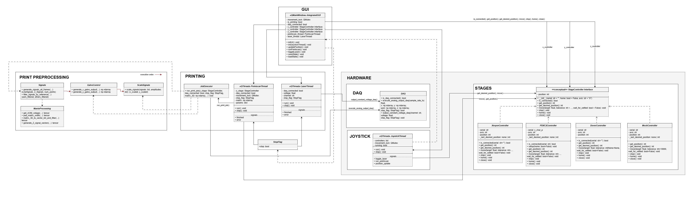
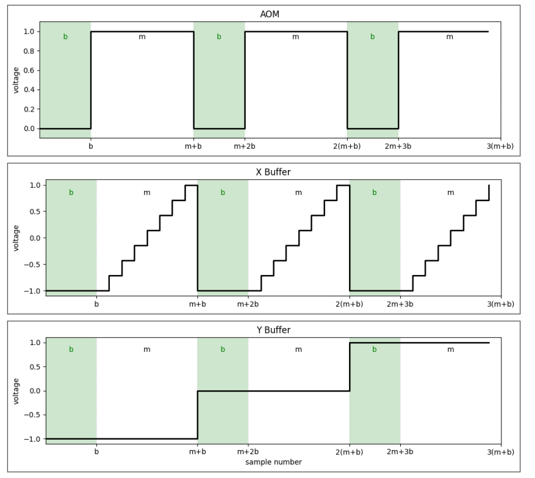
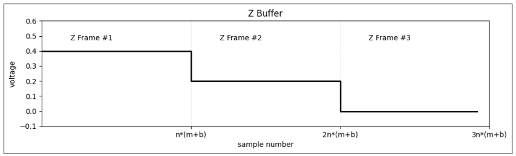

# Software Overview

## Software Workflow
The Irradiant-2photon software synchronizes: X/Y galvo scanning, AOM power modulation, Z-axis motion.

The diagram below provides an overview of the Irradiant-2photon printing workflow. It shows how the GUI initializes connections to hardware (NI DAQ and stage controllers), accepts user input for printing and manual stage control, and creates dedicated threads for laser control and printing. 
- The printing pipeline includes pre-processing of the input print file, followed by a frame-by-frame execution loop that coordinates Z-axis motion with XY scanning. 
- The right side of the diagram details stage controller selection and homing logic for the supported backends (Xeryon, PDXC2, Dover, or mock controllers).

## Software Architecture
This UML diagram describes the internal software architecture of the Irradiant-2photon printing system, specifically the relationships between the GUI, printing pipeline, hardware interfaces, and stage controllers.

## Control Signals
Below are the diagrams for the control signals of the AOM and the X and Y galvos. These represent a case where the full galvo FOV is printed, and the AOM remains on during patterning.

The x-axis of these diagrams corresponds to the number of samples sent to the DAQ signal generator, at a frequency of 1 / (time per pixel) specified by the user. The variable `b` represents the number of blanking samples for the galvo return time, and `m` represents the number of pixels in the X galvo direction.

In a realistic setting, the cycle `(m + b)` repeats for the number of lines specified in the Y direction.

Below is an example of the Z buffer that gets produced, where `n` represents the number of Y lines, and one Z frame corresponds to the three signals described above. The figure shows the signal in the context of a piezo-driven Z axis, expressed as a voltage waveform.

This is diagram is provided as an example. For stages that require position as the input, an equivalent Z control signal is generated and sent to the active Z stage, with the appropriate units applied on the y-axis. For piezo stages, this signal is expressed as voltage, whereas for motorized stages it is converted to a position command.

For objective-mounted focus stages (e.g., Dover Motion DOF-5), the direction of motion is inverted relative to sample-mounted stages. While a sample-mounted Z stage moves downward to progress through printed layers, an objective-mounted stage must move upward, since the first printed plane corresponds to the bottom of the volume.